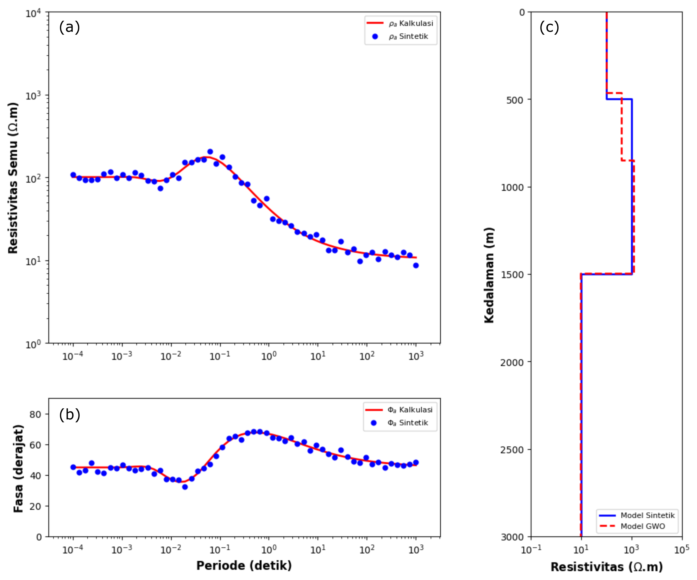

# GWO-MT1D
Application of Grey Wolf Optimizer (GWO) in One-Dimensional Magnetotelluric Inversion

An implementation of the Grey Wolf Optimizer (GWO) algorithm for one-dimensional magnetotelluric (MT) inversion. This repository includes the source code, examples, and documentation to demonstrate the application of GWO in processing MT data. Ideal for geophysicists and researchers working on electromagnetic methods or optimization algorithms.

